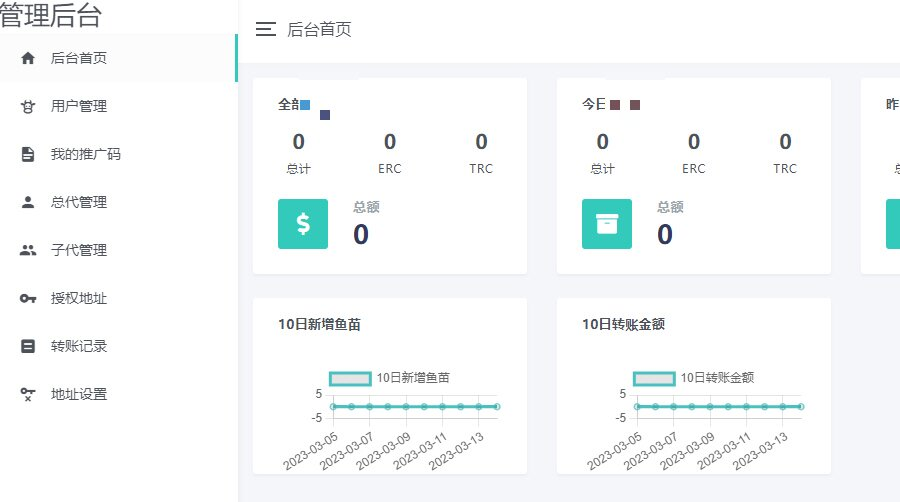
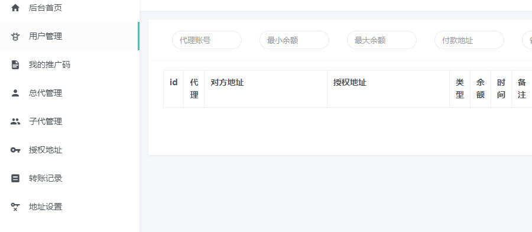
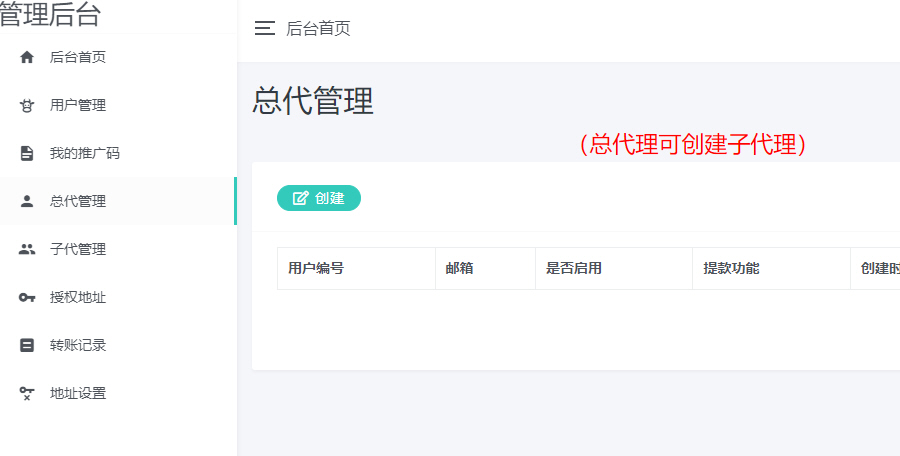
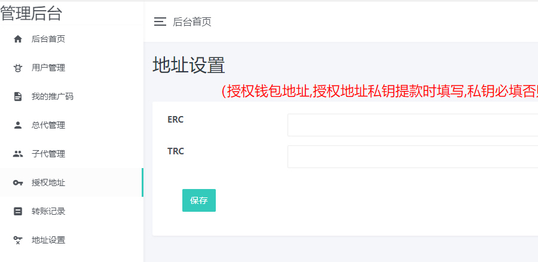
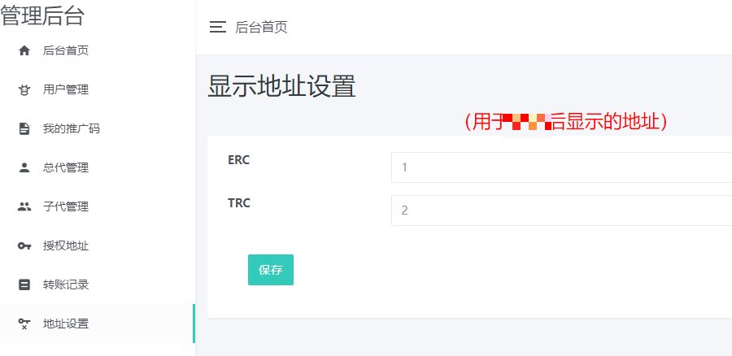
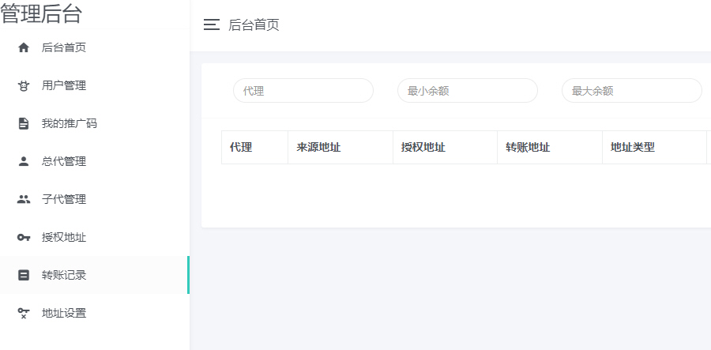

# 基于Web3|Dapp区块链源码|Defi|NFT|钱包浏览器|Swap源码

演示地址：https://dappt.waps.eu.org/admin/

功能列表：
1：基于Web3自动链接钱包。

2：Dapp的项目。

3：多语言。

4：支持基于web3的区块浏览器钱包。

5：后台功能强大。

（Ver 2.03）

1: 此钱包基于TP5.1的内核。

2: 优化并修复众多bug。

3: 移除多余的js代码。

4: 优化后端速度。

## Screenshots

亲爱的各位买家朋友，懂源码就直接购买；

1. 在使用本系统时，使用方必须在国家相关法律法规范围内并经过国家相关部门的授权许可，禁止用于一切非法行为。
2. 
3. 本系统的使用用途仅限于测试、实验、研究为目的，禁止用于一切商业运营，本团队不承担使用者在使用过程中的任何违法行为负责。
4. 
5. 源码以演示站为准。
6. 

注：
1、请勿以无法对接或者其他相关问题退款，本店所有技术服务均为收费费用；

2、商品设置的安装调试只是单网站运行环境配置，不包含其它任何相关配置；

3、如源码存在问题可以购买的技术服务；本店承接数字资产相关服务；

4、网站相关接口均为收费配置；

5、请不要以任何这样那样的问题说程序无法运行；

描述此节主要防止骗取源码朋友，报骗取源码心态请绕行；

我们尽快我们所服务能力服务好我们忠实用户；

